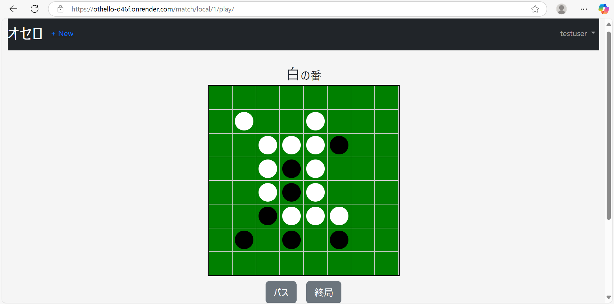

# オセロWebアプリ

## 概要
オセロアプリをDjangoで開発しています。現在(2025年5月10日)、オセロのローカル対戦機能を実装済みです。

## 開発ドキュメント
- 開発ドキュメントは[こちら](docs/README.md)をご覧ください。

## スライド
- [スライド](docs/presentation/slides.pdf)

## 機能一覧
- ローカル対戦(同一画面で2人対戦)

## 使用技術

| 分類         | 技術                                      |
|--------------|-------------------------------------------|
| バックエンド | Django                                    |
| フロントエンド | HTML / CSS / JavaScript / Bootstrap       |
| データベース | SQLite（開発環境） / PostgreSQL（本番環境） |

## 画面イメージ


## 必要な環境・依存関係
- **Pythonバージョン**: 3.12（動作確認済み）
- **依存ライブラリ**:
  - Django 5.1.7

## セットアップ手順

  ```bash
  # `pipenv`で必要なライブラリをインストールします。
  pipenv install
  # 仮想環境を起動します。
  pipenv shell
  # マイグレーションを行います。
  python manage.py migrate
  # ローカルサーバーを起動します。
  python manage.py runserver
  # その後、ブラウザで`http://127.0.0.1:8000/`にアクセスしてください。
  ```
    

## 使用方法

1. `http://127.0.0.1:8000/`にアクセスしてください。
2. ゲームを遊ぶには、アカウントの作成が必要です。右上のサインアップから、アカウントを作成してください。
3. 作ったアカウントでログインすると、左上に+Newボタンが現れます。このボタンから、新しいゲームを作ってください。
4. 「対局履歴」から、過去の対局を確認することも可能です。対局を中断して、再開することもできます。

## テスト方法

次のコマンドを実行して、テストを行ってください。
  ```bash
  python manage.py test
  ```

## デプロイ
- RenderとNeonでデプロイしています。URLは[こちら](https://othello-d46f.onrender.com/)です。
- システム構成図は以下の通りです。詳細は[開発ドキュメント](docs/README.md)をご覧ください。
  ### 