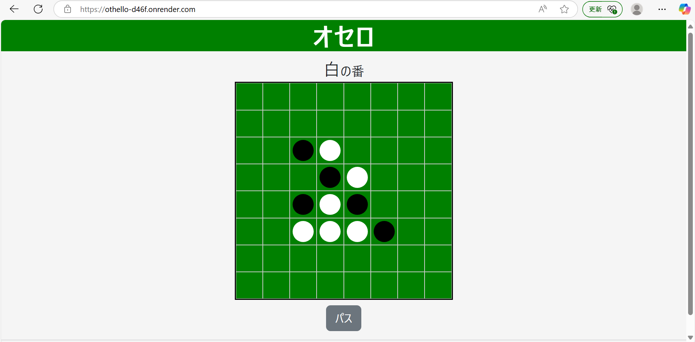

# オセロWebアプリ

## 概要
オセロアプリをDjangoで開発しています。現在(2025年4月7日)、オセロのゲーム機能（駒を打つ、パスする）を実装済みです。順次機能を追加していきます。

## 開発ドキュメント
- 開発ドキュメントは[こちら](docs/README.md)をご覧ください。

## 機能一覧
- ローカル対戦(同一画面で2人対戦)

## 使用技術

| 分類         | 技術                                      |
|--------------|-------------------------------------------|
| バックエンド | Django                                    |
| フロントエンド | HTML / CSS / JavaScript / Bootstrap       |
| データベース | SQLite（開発環境） / PostgreSQL（本番環境） |

## 画面イメージ


## 必要な環境・依存関係
- **Pythonバージョン**: 3.12（動作確認済み）
- **依存ライブラリ**:
  - Django 5.1.7

## セットアップ手順

    ```bash
    #`pipenv`で必要なライブラリをインストールします。
    pipenv install
    #仮想環境を起動します。
    pipenv shell
    #マイグレーションを行います。
    python manage.py migrate
    # ローカルサーバーを起動します。
    python manage.py runserver
    # その後、ブラウザで`http://127.0.0.1:8000/`にアクセスしてください。
    ```
    

## 使用方法

ゲームは`http://127.0.0.1:8000/`で遊ぶことができます。新しくゲームを始めるには、`http://127.0.0.1:8000/start_new_game`にアクセスしてください。ゲームを初期化したのち、`http://127.0.0.1:8000/`にリダイレクトします。ただし、現在の仕様では、`http://127.0.0.1:8000/start_new_game`にアクセスするたびに、オセロゲームの既存データベースを削除し、初期状態のゲームを１つ新しく作るようにしています。この仕様は、近いうちに修正する予定です（セッションを使うつもりです）。

## テスト方法

次のコマンドを実行して、テストを行ってください。
  ```bash
  python manage.py test
  ```

## デプロイ
- Renderでデプロイしています。URLは[こちら](https://othello-d46f.onrender.com/)です。