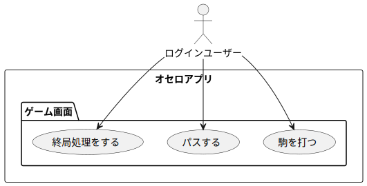

# 📄 オセロアプリ開発ドキュメント(v0.2.x)

---

## 1. プロジェクト概要

- **プロジェクト名：**  オセロアプリ開発プロジェクト
- **開発目的：**  Djangoを用いて、オセロアプリを楽しく開発する。
- **ターゲットユーザー：**  オセロ好きの人すべて。
- **利用シーンの想定：**  
    - 同じ場所にいる人どうしで対戦する
    - 離れた場所にいる人どうしで対戦する（検討中）
    - コンピュータ相手に対戦する（検討中）
- **開発スコープ：**

    作成日 : 2025-04-27

    ---

    - 対象範囲（スコープに含まれる機能）
        - ユーザー登録、ログイン、ログアウト、パスワード変更などのアカウント機能
        - 対戦機能
            - ログインして、同じ場所にいるユーザーが対戦する（ローカル対戦）
        - 盤面管理
            - オセロの基本的なロジックを実装
                - ターンの表示
                - 盤面の表示
                - 駒をおける場所の検出、ひっくり返すロジックの実装
                - 勝敗判定
        - 過去の対局閲覧機能
            - ゲームの状態をデータベースに保存（途中からプレイ可能）
        - パーミッション管理
            - ログインユーザーのみがゲーム機能にアクセスできるよう制限
            - その場にいるユーザー（ログインしているユーザー）のみがゲームにアクセスできるように制限
        
        - レスポンシブデザイン

    - スコープ外機能で、今後追加を検討するもののリスト(v1.0.0以降)  
        - ゲストユーザーによるローカル対戦
            - ログイン不要で、ゲストユーザーとしてローカル対戦ができる（セッションを使う）
        - オンライン対戦のマッチングシステム
            - マッチングシステムや待機画面を実装
            - リアルタイム対戦機能（Web Socket）
        - AI対戦機能
---

## 2. 要件定義

### 2.1 機能要件

## v1.0.0で実装予定の機能

| No | 機能名             | 概要                                                     |
|----|--------------------|----------------------------------------------------------|
| 1  | ユーザー登録       | ユーザーがメールアドレス、ユーザー名とパスワードを登録 |
| 2  | ログイン           | 登録済みのユーザーがログインできる                     |
| 3  | ログアウト         | ログイン中のユーザーがログアウトする                   |
| 4  | パスワード変更     | メールアドレスを使って、パスワードを変更できる         |
| 5  | ローカル対戦       | ログインユーザーがローカルに対戦できる                 |
| 6  | オセロのロジック   | ターン管理、盤面の状態管理、駒の反転、勝敗判定など     |
| 7  | 履歴保存機能       | オセロの履歴を保存する。途中再開も可能                 |
| 8  | パーミッション     | アカウントごとにゲームへのアクセス制限を設ける         |

## v1.0.0以降で実装を検討する機能
| No | 機能名               | 概要                                                       |
|----|----------------------|------------------------------------------------------------|
| 1  | リモート対戦         | ネット越しでユーザー同士が対戦できるようにする             |
| 2  | 対戦相手検索         | ユーザー名などで対戦相手を検索し、一覧表示できるようにする |
| 3  | 対戦申し込み / 承諾 | 対戦申請を送り、承諾することでリモート対戦を開始できる     |
| 4  | コンピュータ対戦     | AIと対戦できるモードを実装。難易度も選択可能にする         |
| 5  | リアルタイム対戦     | WebSocketを使って、遅延のないリアルタイムな対戦を実現する   |

### 2.2 非機能要件

- **パフォーマンス要件：**（例：初期表示1秒以内）  
- **セキュリティ要件：**（例：JWTを使った認証）  
- **対応ブラウザ / デバイス：** 
    - レスポンシブデザインとする
- **サポート期間・更新頻度の想定：**

### 2.3 ユースケース図
#### アカウント機能
  
#### ゲーム管理
  
#### ゲームプレイ
  
#### 用語
  ユースケース図の用語は[こちら](usecase/usecase.md)をご覧ください。

---

## 3. 画面設計

### 3.1 画面一覧

| 画面ID | 画面名       | 概要                       | 
|--------|--------------|----------------------------|
| G001   | ホーム画面 | ログイン・ログアウト・対戦選択 | 
| G002   | ローカル対戦画面 | ローカル対戦を行う画面         |
| G003   | リモート対戦待合   | リモート対戦のマッチングを行う画面   |
| G004   | リモート対戦画面 | リモート対戦を行う画面 |

詳細は[UI設計書](ui_design/ui_design.md)をご覧ください（順次作成予定）。

### 3.2 画面遷移図

---

## 4. データベース設計

### 4.1 ER図

### 4.2 テーブル定義

#### ユーザーアカウント テーブル

| カラム名     | 型           | 主キー | NotNull | 概要                             |
|--------------|--------------|--------|---------|----------------------------------|
| `user_id`    | `INT`        | ○      | ○       | ユーザーを一意に識別するID       |
| `email`      | `VARCHAR(255)`|        | ○       | ユーザーのメールアドレス（ユニーク制約） |
| `user_name`  | `VARCHAR(255)`|        | ○       | ユーザーネーム（ユニーク制約）|
| `password`   | `VARCHAR(255)`|        | ○       | ハッシュ化されたパスワード       |

#### ゲーム テーブル

| カラム名     | 型             | 主キー | NotNull | 概要                           |
|--------------|----------------|--------|---------|--------------------------------|
| `game_id`    | `INT`          | ○      | ○       | ゲームを一意に識別するID       |
| `player1_id` | `INT`          |        | ○       | プレイヤー1のユーザーID（外部キー） |
| `player2_id` | `INT`          |        | ○       | プレイヤー2のユーザーID（外部キー） |
| `turn`       | `VARCHAR(255)` |        | ○       | 現在の手番を表す（プレイヤーID等） |
| `board`      | `JSON`         |        | ○       | 現在の盤面の状態（JSON形式）    |

詳細は[DB設計書](DB_design/DB_design.md)をご覧ください。

---

## 5. API仕様書
- APIは使用しない

---

## 6. 開発スケジュール（マイルストーン）

| フェーズ         | 期間              | 作業内容                             |
|------------------|-------------------|--------------------------------------|
| 要件定義         | 2025/04/10〜      | 機能の洗い出し、構想固め             |
| 設計             | 2025/04/10〜      | 画面設計・DB設計・API設計            |
| 実装             | 2025/03〜      | フロント・バックエンド実装           |
| テスト           | 2025/03〜      | 動作検証・バグ修正                   |
| デプロイ・公開   | 2025/03〜      | 本番環境への公開                     |

---

## 7. デプロイ・運用

- Renderでデプロイする。
    [othello](https://othello-d46f.onrender.com/)

---

## 8. 保守・改善方針

- **障害発生時の対応手順：**  
- **ユーザーからのフィードバック収集方法：**  
- **機能追加の優先度ルール：**
    1. ローカル対戦（セッション機能を実装する）

---

## 🔚 備考欄

- 利用ライブラリや依存関係の記載  
- バージョン管理ルール（Gitの運用ルール）  
- 今後のアップデート構想など

## 変更履歴

開発ドキュメント、および、プログラムの変更履歴は[こちら](CHANGELOG.md)をご覧ください。