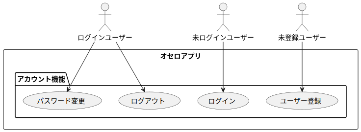
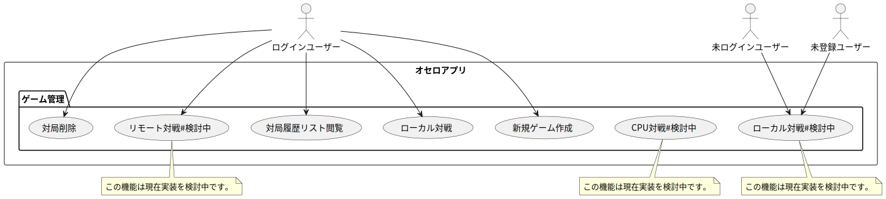
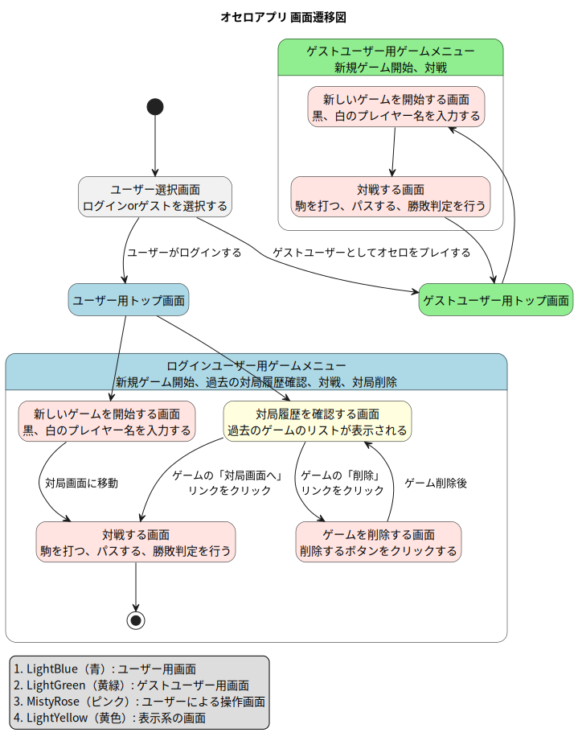
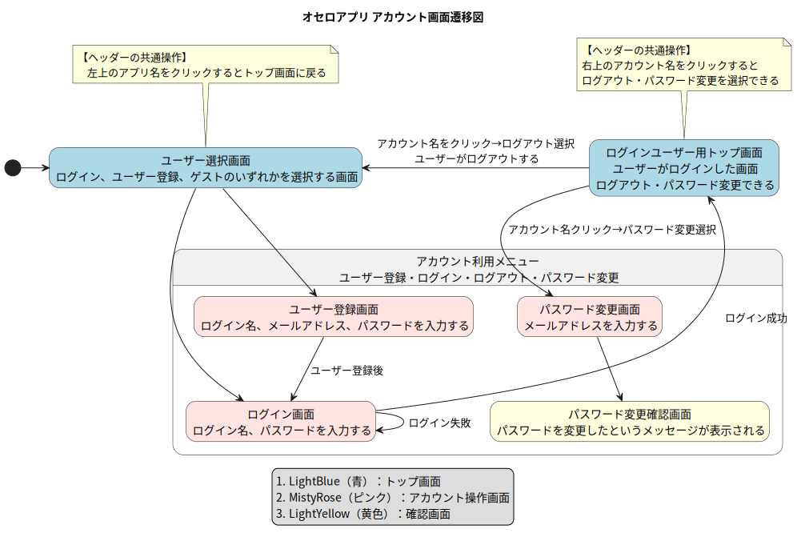
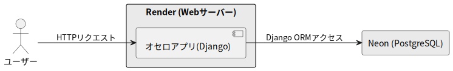

# 📄 オセロアプリ開発ドキュメント

---

## 1. プロジェクト概要

- **プロジェクト名：**  オセロアプリ開発プロジェクト
- **開発目的：**  Djangoを用いて、オセロアプリを楽しく開発する。
- **ターゲットユーザー：**  オセロ好きの人すべて。
- **利用シーンの想定：**  
    - 同じ場所にいる人どうしで対戦する
    - 離れた場所にいる人どうしで対戦する（検討中）
    - コンピュータ相手に対戦する（検討中）
- **開発スコープ：**

    ---

    - v1.0.0 の機能スコープ（対象範囲）
        - ユーザー登録、ログイン、ログアウト、パスワード変更などのアカウント機能
        - 対戦機能
            - ログインして、同じ場所にいるユーザーが対戦する（ローカル対戦）
        - 盤面管理
            - オセロの基本的なロジックを実装
                - ターンの表示
                - 盤面の表示
                - 駒をおける場所の検出、ひっくり返すロジックの実装
                - 勝敗判定
        - 過去の対局閲覧機能
            - ゲームの状態をデータベースに保存（途中からプレイ可能）
        - パーミッション管理
            - ログインユーザーのみがゲーム機能にアクセスできるよう制限
            - その場にいるユーザー（ログインしているユーザー）のみがゲームにアクセスできるように制限
        
        - レスポンシブデザイン
    
    - v2.0.0 の追加機能
        - ゲストユーザーによるローカル対戦
            - ログイン不要で、ゲストユーザーとしてローカル対戦ができる（セッションを使う）

    - 今後の追加を検討している機能（v1.1.0以降） 
        - オンライン対戦のマッチングシステム
            - マッチングシステムや待機画面を実装
            - リアルタイム対戦機能（Web Socket）
        - AI対戦機能
---

## 2. 要件定義

### 2.1 機能要件

#### v1.0.0で実装した機能

| No | 機能名             | 概要                                                     |
|----|--------------------|----------------------------------------------------------|
| 1  | ユーザー登録       | ユーザーがメールアドレス、ユーザー名とパスワードを登録 |
| 2  | ログイン           | 登録済みのユーザーがログインできる                     |
| 3  | ログアウト         | ログイン中のユーザーがログアウトする                   |
| 4  | パスワード変更     | メールアドレスを使って、パスワードを変更できる         |
| 5  | ローカル対戦       | ログインユーザーがローカルに対戦できる                 |
| 6  | オセロのロジック   | ターン管理、盤面の状態管理、駒の反転、勝敗判定など     |
| 7  | 履歴保存機能       | オセロの履歴を保存する。途中再開も可能                 |
| 8  | パーミッション     | アカウントごとにゲームへのアクセス制限を設ける         |

#### v2.0.0で実装した機能
| No | 機能名               | 概要                                                       |
|----|----------------------|------------------------------------------------------------|
| 1  | ゲストユーザープレイ   | ログインせずにオセロをプレイできるようにする             |

#### v2.0.0以降で実装を検討する機能
| No | 機能名               | 概要                                                       |
|----|----------------------|------------------------------------------------------------|
| 1  | リモート対戦         | ネット越しでユーザー同士が対戦できるようにする             |
| 2  | 対戦相手検索         | ユーザー名などで対戦相手を検索し、一覧表示できるようにする |
| 3  | 対戦申し込み / 承諾 | 対戦申請を送り、承諾することでリモート対戦を開始できる     |
| 4  | コンピュータ対戦     | AIと対戦できるモードを実装。難易度も選択可能にする         |
| 5  | リアルタイム対戦     | WebSocketを使って、遅延のないリアルタイムな対戦を実現する   |

### 2.2 非機能要件  
- **セキュリティ要件：** 
  - CSRF対策として、DjangoのCSRFトークン機構を有効化する。
  - データベースアクセスは Django ORM を使用し、SQLインジェクション対策を講じる
  - XSS対策 : 本アプリではユーザー入力を受け付けるのはアカウント関連機能のみであり、すべてDjangoの標準フォームおよびテンプレートエンジンを使用している。
  - SECRET_KEY やデータベース接続情報などの機密設定値は、環境変数で管理し、コード内にハードコーディングしない。
- **対応ブラウザ / デバイス：** 
    - レスポンシブデザインとする
    - PC、スマートフォン、タブレットなどの主要デバイスに対応し、画面幅に応じてレイアウトが自動調整されるレスポンシブデザインとする。

### 2.3 ユースケース図
#### アカウント機能
  
#### ゲーム管理
  
#### 用語
  ユースケース図の用語は[こちら](usecase/usecase.md)をご覧ください。

---

## 3. 画面設計

### 3.1 画面一覧

#### 全体の流れに関わる画面
| 画面ID | 画面名       | 概要                       | 備考               |
|--------|--------------|----------------------------|------------------|
| G001   | ホーム画面 | トップページ。アカウント機能・対局履歴・新規ゲーム | ログイン前には、新規ゲームは表示されない。ログイン後、対局履歴ボタンか新規ゲームボタンを選択 | 
| G002   | 新規ゲーム作成画面 | 新しいゲームを作る画面         | 黒、白のプレイヤー名を入力し、新規ゲーム作成ボタンを押す |
| G003   | 対局履歴確認画面   | 過去の対局リストを確認できる。   | ゲーム情報の確認、削除、再開が可能。 |
| G004   | ゲーム削除画面 | 過去のゲームを削除できる |   |
| G005   | ゲームプレイ画面 | オセロゲームをプレイする | 駒を打つ、パスする、終局処理（駒の枚数を数え、勝敗を決める）をする | 

#### アカウントにかかわる画面
| 画面ID | 画面名       | 概要                       | 備考               |
|--------|--------------|----------------------------|------------------|
| A001(G001) | ホーム画面 | トップページ。ヘッダー右上のボタンからアカウント機能を操作する | ログイン前・後でアカウント機能が変わる |
| A002 | ユーザー登録画面 | アカウントを新規登録する | 未ログイン状態で表示される |
| A003 | ログイン画面 | アカウントを持ったユーザーがログインする | 未ログイン状態で表示される |
| A004 | パスワード変更画面 | ユーザーがパスワードを変更する | ログイン状態で表示される |
| A005 | パスワード変更確認 | パスワード変更後の確認画面 | パスワード変更後に表示される |

### 3.2 画面遷移図
#### 全体の推移
  
#### アカウントの機能の推移
  

---

## 4. データベース設計

### 4.1 ER図

### 4.2 テーブル定義
- 外部キー、ユニーク、DEFAULTは概要欄に記載する
#### ユーザーアカウント テーブル

| カラム名     | 型           | 主キー | NotNull | 概要                             |
|--------------|--------------|--------|---------|----------------------------------|
| `id` | `BigAutoField`| ○      | ○       | ユーザーを一意に識別するID       |
| `username`  | `CharField`|        | ○       | ユーザーネーム（ユニーク制約）|
| `email`      | `EmailField`|        | ○       | ユーザーのメールアドレス（ユニーク制約なし） |
| `password`   | `CharField`|        | ○       | ハッシュ化されたパスワード       |
| `level` | `CharField` |  | ○ | ユーザーのレベル（選択式）。BEGINNER, INTERMEDIATE, ADVANCED の3段階から選択。default="beginner" |

#### ログインユーザーのローカル対戦 テーブル

| カラム名     | 型             | 主キー | NotNull | 概要                           |
|--------------|----------------|--------|---------|--------------------------------|
| `id`    | `BigAutoField`          | ○      | ○       | ゲームを一意に識別するID       |
| `authenticated_user` | `ForeignKey(id)` |  | ○ | ユーザーアカウントの主キーを参照 | 
| `created_at` | `DateTimeField`|        | ○       | ゲームの作成時刻 |
| `updated_at` | `DateTimeField`|        | ○       | ゲームの最終着手時刻 |
| `black_player`| `CharField` |        | ○       | 黒のプレイヤー名 |
| `white_player`| `CharField` |        | ○       | 白のプレイヤー名 |
| `turn`  | `CharField` |    |   ○   | 現在のターン。default="black's turn"  |
| `board`      | `JSONField`         |        | ○       | 現在の盤面の状態（JSON形式）。defaultとして、盤面の初期状態を定義。    |
| `result` | `CharField` |  | ○ | 対局のステータス。default="対局中" | 

---

## 5. API仕様書
- APIは使用しない

---

## 6. 開発履歴
| フェーズ         | 期間              | 作業内容                             |
|------------------|-------------------|--------------------------------------|
| 実装（第1段階）   | 2025/03/14ごろ〜4/7ごろ  | オセロゲームの実装（ロジック（駒を打つ、パスする）や盤面の管理）           |
| 要件定義・設計    | 2025/04/04〜2025/04/14     | 機能の洗い出し、ユースケース図、画面遷移図などの設計、ドキュメント作成          |
| 実装（第2段階）            | 2025/04/14〜2025/04/27      | アカウント機能、ゲーム管理機能、ゲームプレイのリファクタリング      |
| ドキュメント更新 | 2025/04/27~2025/05/12 | 実装中に生じた変更をドキュメントに反映 |
| テスト | 2025/05/01~2025/05/06 | ユニット・統合テストを実装 |
| 実装（第3段階） | 2025/05/17~2025/05/30 | ゲストユーザーのオセロゲームプレイの実装・テスト |

---

## 7. デプロイ・運用

- バックエンド : Render。
  - 本番環境（mainブランチ）URL:  
    [https://othello-main.onrender.com/](https://othello-main.onrender.com/)

  - 過去バージョンのデプロイURL:  
    - v1.0.0のURL: [https://othello-d46f.onrender.com/](https://othello-d46f.onrender.com
    )  
    - v2.0.0のURL: [https://othello-feature-guest-user-play.onrender.com/](https://othello-feature-guest-user-play.onrender.com/)

  - 機能開発用プレビュー環境（feature/guest-user-playブランチ）URL:  
    [https://othello-feature-guest-user-play.onrender.com/](https://othello-feature-guest-user-play.onrender.com/)
- データベース : Neon 
- システム構成図 : 以下の構成図に示すように、バックエンドは Render、データベースは Neon を利用。
  ### 
---

## 8. 保守・改善方針

- **機能追加の優先度ルール：**
    1. ローカル対戦（ログインユーザーがローカル対戦できる）
    2. ローカル対戦（セッション機能を実装して、ログインなしでもプレイできるようにする）
    3. リモート対戦（ユーザー間のマッチングや、Web Socketの導入）
    4. コンピュータ対戦機能（AIロジックの実装）

---

## 🔚 備考欄

- 利用ライブラリや依存関係の記載  
- バージョン管理ルール（Gitの運用ルール）  
- 今後のアップデート構想など

## 変更履歴

開発ドキュメント、および、プログラムの変更履歴は[こちら](../CHANGELOG.md)をご覧ください。