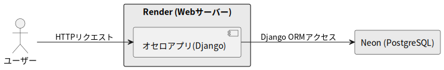

<!-- スライド1：タイトル -->
# オセロアプリの開発と発表  
### 塩崎友貴

---

<!-- スライド2：発表の流れ -->
## 発表の流れ

### 1. 背景と目的  
### 2. 使用した技術と工夫した点  
### 3. アプリのデモ  
### 4. 今後の課題とまとめ

---

<!-- スライド3 : 背景と目的 -->
## 背景と目的

- Pythonでpygameを使ったゲーム開発を勉強し、学んだ知識でオセロを作成したことがあった
- Webアプリ開発の練習として、このオセロを題材にし、Webアプリとして再構成してみることにした
- 目的：オセロのゲームを作るには、フロントエンド・バックエンドをどう連携する必要があるかを知る。

<!-- スライド : 詳細説明 -->
---

## 詳細説明（技術スタックと構成）
| 分類         | 技術                                      |
|--------------|-------------------------------------------|
| バックエンド | Django                                    |
| フロントエンド | HTML / CSS / JavaScript / Bootstrap       |
| データベース | SQLite（開発環境） / PostgreSQL（本番環境） |

####

